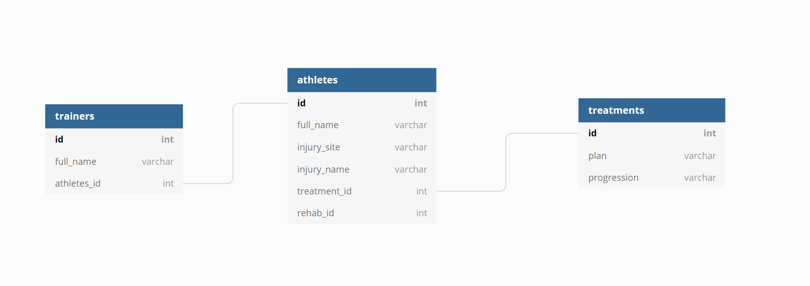
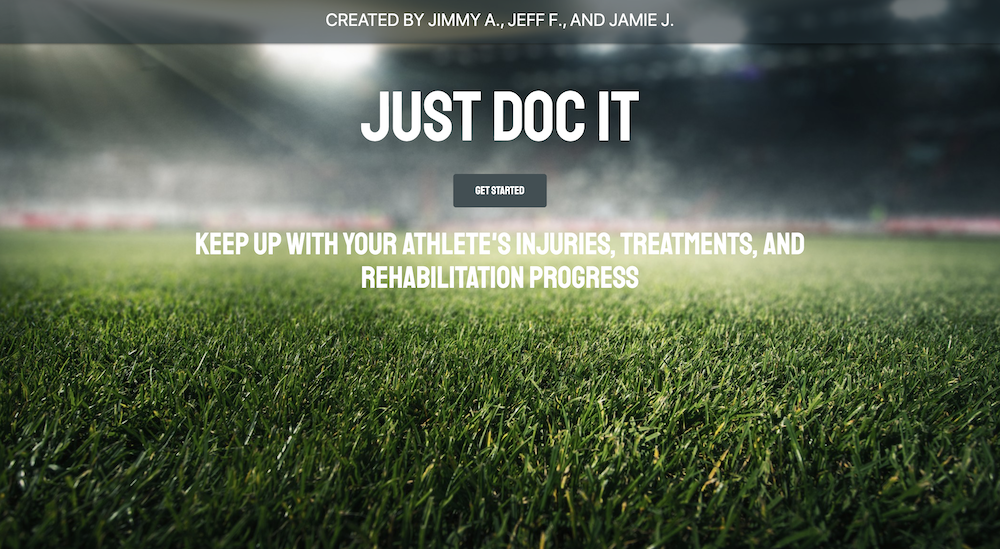
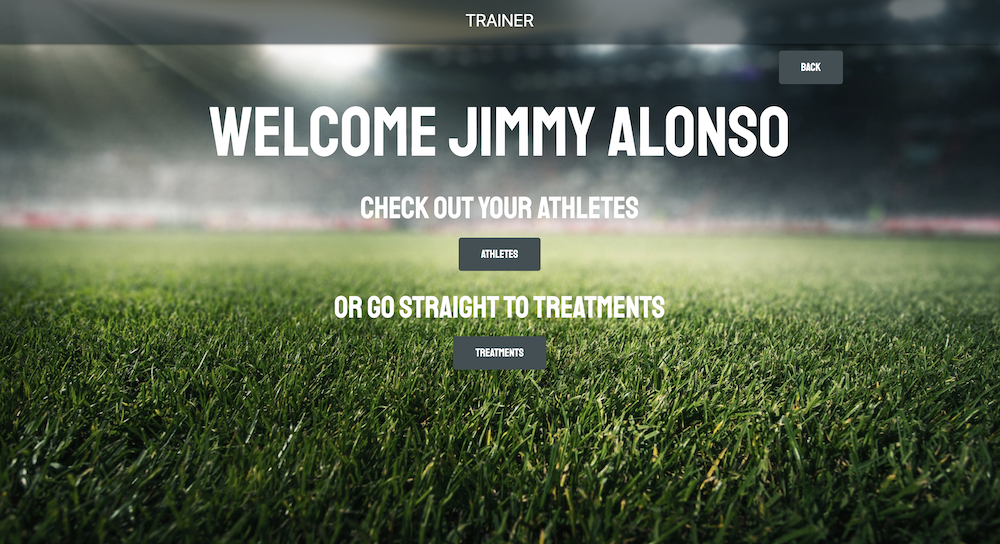
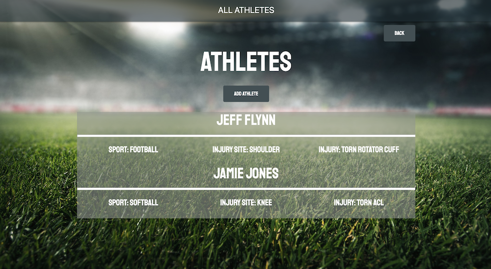
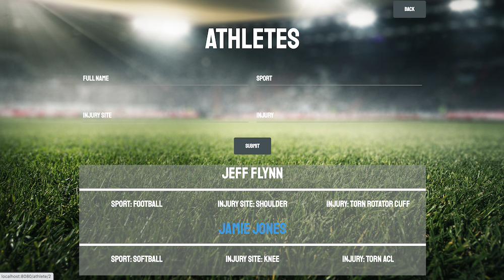
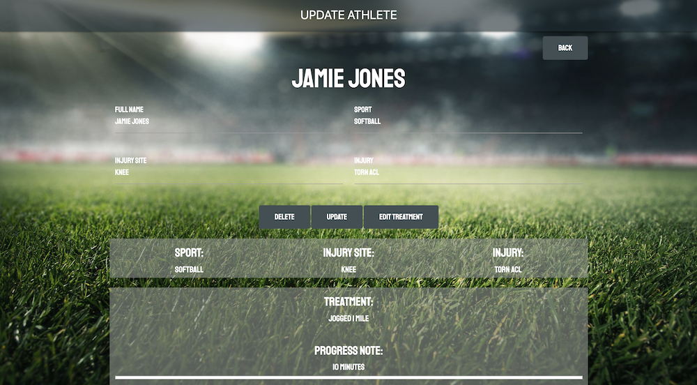
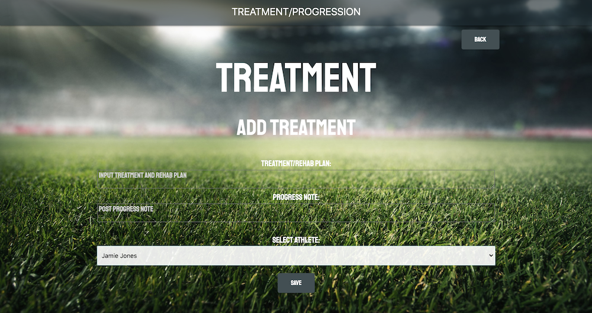

# project-2:  "JUST-DOC-IT"

## Table of Contents
#### &nbsp;&nbsp;&nbsp;&nbsp;[1)&nbsp;Introduction](#introduction)
#### &nbsp;&nbsp;&nbsp;&nbsp;[2)&nbsp;Description](#description)
#### &nbsp;&nbsp;&nbsp;&nbsp;[3)&nbsp;Features](#features)
#### &nbsp;&nbsp;&nbsp;&nbsp;[4)&nbsp;Usage](#usage)
#### &nbsp;&nbsp;&nbsp;&nbsp;[5)&nbsp;Contributing](#contributing)
#### &nbsp;&nbsp;&nbsp;&nbsp;[6)&nbsp;License](#license)
#### &nbsp;&nbsp;&nbsp;&nbsp;[7)&nbsp;Questions](#questions)   

## Introduction 

This "project-2" of the Georgia Tech Full Stack Flex Full-Time Coding program is another opportunity to work together withour peers to achieve a project's requirements within given restraints.  This time we have been asked to develop a "Full Stack" application using the MVC paradigm and our own server-side API with the following goals:
    1) We had to use a Node and Express server.
    2) Handlebars.js must be the template engine.
    3) The application must be backed by a MySQL database with a Sequelize ORM.
    4) We must utilize full CRUD routes for retrieving and adding new data.
    5) The application must be depoloyed using Heroku (with data).
    6) Include at least one new library, package, or technology that we haven't discussed.
    7) Front end/UI must be polished.
    8) Folder structure must meet the MVC paradigm.
    9) Must meet good quality coding standards (indentation, scoping, naming).
    10) Must protect API keys in Node with environment variables.

The app also had to be responsive.

## Description

The concept/idea for this project came from group member John ("Jimmy") Alonzo and the inspiration for it was his current work experience as a high school athletic trainer.  Jimmy interacts with many athletes across different sports at odd times and in busy settings.  He needs a simple documentation system to record athletes' sports-related injuries and ailments along with their treatment and rehab plans along with progress notes.  He needs easy access to these plans and notes so that he can continue to tailor rehab programs pertaining to each individual athlete's needs.

Jimmy's User Story can be summed up as follows:

--AS A  school athletic trainer who needs instant access to treatment records,

--I NEED an application that helps me record
        -Athlete’s name or other identifier along with the sport
		-Athlete’s injury location and type
		-Treatment / rehab plans
		-Progress notes

--SO THAT I have quick and easy access to that information in a clean format.

The school where Jimmy is currently employed are frequently being pitched very expensive, complicated software program options that they don't want to use because of the price and the perceived difficulty of use.

One aspect of this project that makes it stand out is the combination of effective and quality styling that also balances the need for functionality, since the intended users of this app are going to be far more interested in the latter.  A background image was chosen that conveys "high school sports" and the "Friday night lights" aspect of them that is so familar to many.  But it is not a "football" image, rather the field is empty and waiting for any sport to be played.  The field also suits nicely as a background for the app's functionality.

The name and tagline "Just Doc It" conjures up a combination of sports and medicine which communicates effectively what the app provides to its intended user.

Much was learned in this project especially on the "backend" and with using a mySQL database.  It was great experience to combine this with the frontend development that we already had experience with.

## Features

This website application allows a user (a "trainer") to add athletes to their database of athletes they work with through an easy and intuitive "create Athlete" form.  The created Athletes then populate the trainer's "Athletes" page.  From there the trainer can simply click on an Athlete's name and see a summary of name, sport, injury site, and specific injury.  These fields can be Updated through a simple and intuitive edit of each field.  Some examples of when these fields might be used would be 1) when a two-sport athlete moves from a fall sport to a winter sport or 2) when an initial injury diagnosis is changed upon further examination.  An Athlete can be deleted at the touch of a button when no longer under Trainer care or in attendance at the school.

From this page the Trainer can also "Add Treatment".  Clicking on this link takes the Trainer to the "Treatment" page and here the Trainer can log the date and treatment/rehab plan along with progress notes.  The page is prepopulated with the name of the Athlete from who's page the Trainer last visited but if in the instance a Trainer decides to add a Treatment to another Athlete instead, the trainer has access to a dropdown menu.  This dropdown menu will connect the Treatment page to another Athlete instead and the Trainer can then update that Athlete's page.  Once a Treatment plan is submitted, it populates on the particular Athlete's individual page and the Trainer now has access to a record of all Treatment dates, plans, rehab, and progress.

The app utilizes a mySQL database with the following tables:  Trainer, Athlete, Treatment.  Trainer is one-to-many with both Athlete and Treatment.  Athlete is one-to-one with Trainer and one-to-many with Treatment.  Treatment is one-to-one with Athlete and one-to-one with Trainer.

## Usage

The URL for this application is http://www.just-doc-it.com.

This application can only be used with fictional athletes and patients until further notice.

To run this app the repo first must be cloned at Github on this link:  https://github.com/jvalon9455/Just-Doc-It

Once cloned a user needs to run npm init -y and then run NPM install for the following dependencies:
--express
--express-handlebars
--handlebars
--@handlebars/allow-prototype-access
--mysql2
--sequelize

## Contributing

J-Squad 2 Collaborators (in alphabetical order by first name):

Jamie Jones: https://github.com/jamjon94
Jeff Flynn: https://github.com/7J647
John ("Jimmy" Alonzo): https://github.com/jvalon9455

With special thanks to TA Peter Colella without who's help we would not have been able to accomplish this project.

## License

---

Permission is hereby granted, free of charge, to any person obtaining a copy
of this software and associated documentation files (the "Software"), to deal
in the Software without restriction, including without limitation the rights
to use, copy, modify, merge, publish, distribute, sublicense, and/or sell
copies of the Software, and to permit persons to whom the Software is
furnished to do so, subject to the following conditions:

The below copyright notice and this permission notice shall be included in all
copies or substantial portions of the Software.

THE SOFTWARE IS PROVIDED "AS IS", WITHOUT WARRANTY OF ANY KIND, EXPRESS OR
IMPLIED, INCLUDING BUT NOT LIMITED TO THE WARRANTIES OF MERCHANTABILITY,
FITNESS FOR A PARTICULAR PURPOSE AND NONINFRINGEMENT. IN NO EVENT SHALL THE
AUTHORS OR COPYRIGHT HOLDERS BE LIABLE FOR ANY CLAIM, DAMAGES OR OTHER
LIABILITY, WHETHER IN AN ACTION OF CONTRACT, TORT OR OTHERWISE, ARISING FROM,
OUT OF OR IN CONNECTION WITH THE SOFTWARE OR THE USE OR OTHER DEALINGS IN THE
SOFTWARE.

---

## Questions

For questions or for other developers who would like to provide feedback on how to improve the work done on this project or offer other suggestions, please feel free to do so via the GitHub repositories provided.

&copy;[2020] [J-Squad 2:  Jamie Jones, Jeff Flynn, and John "Jimmy" Alonzo]